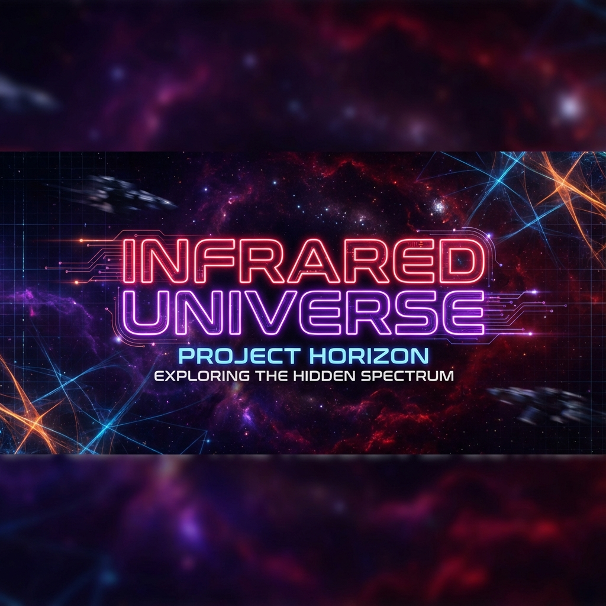

# Infrared Universe: Bria FIBO AI Studio

**An AI-Powered Cinematic Storyboard Creator powered by Bria FIBO.**

[**🚀 Live Demo**](https://bria-fibo-infrared-universe.vercel.app/)



## 🏆 Bria FIBO Hackathon Submission

**Infrared Universe** is a professional production tool that allows filmmakers and game designers to turn raw scripts into fully realized visual storyboards using the power of **FIBO's JSON-native generation**.

### Key Features
- **🤖 The AI Director**: Automatically parses screenplays and infers cinematic parameters (Camera Angle, Lighting, Lens) to generate structured FIBO JSON.
- **🔐 Hybrid Structure Lock**: Unlocks "Video-like consistency" for image generation. Locks the composition of one scene (via Bria V1) while rendering high-fidelity details with FIBO V2 parameters.
- **🎨 Pro Color Grading**: Direct access to FIBO's color palette and grading controls (HDR, Cinematic, Noir).
- **⚡ Real-time Control**: Tweak parameters via a high-end, glassmorphism UI without writing a single text prompt.
- **🚀 Agentic Workflow**: Uses an intelligent Director Agent to break down scripts into shots and infer initial visual parameters.

## Getting Started

1. **Clone & Install**
   ```bash
   git clone https://github.com/samalpartha/Bria-FIBO-infrared-universe.git
   cd infrared-universe
   npm install
   ```

2. **Environment Setup**
   Create a `.env.local` file with your Bria API Key (optional, defaults to demo mode if missing):
   ```
   NEXT_PUBLIC_BRIA_API_KEY=your_key_here
   ```

3. **Run Dev Server**
   ```bash
   npm run dev
   ```
   Open [http://localhost:3000](http://localhost:3000).

## Workflow Guide
Check out [WALKTHROUGH.md](WALKTHROUGH.md) for a deep dive into the Agentic Workflow and Hybrid Pipeline.

## Tech Stack
- **Engine**: Bria FIBO V2 + Bria V1 (Hybrid)
- **Frontend**: Next.js 16 (Turbopack), TailwindCSS, Framer Motion
- **Language**: TypeScript
- **Best Practices**: Strict Linting, Component Architecture, Type Safety

---
*Built for the Bria FIBO AI Challenge 2024.*
